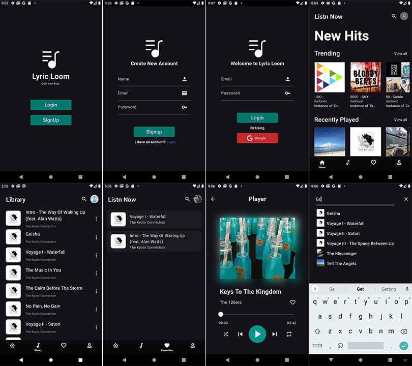

# Music Player Mobile Application

The Music Player Mobile Application is a comprehensive and feature-rich application built with Flutter and Firebase. It offers a seamless music streaming experience with functionalities like authentication (using email/password and Google sign-in), state management with MobX, REST API data management, and persistent storage. The application boasts an attractive UI and is designed to meet client requirements with a robust and maintainable project structure.


## Features

- **Authentication:** Secure user authentication      using Firebase Authentication for sign-up, login, and sign-out functionalities, including Google sign-in.
- **State Management:** Efficient state management with MobX, ensuring reactive programming and automatic UI updates.
- **REST API Integration:** Integration with Deezer's API and a Google Cloud Storage API to fetch and manage music data, allowing users to browse and interact with playlists.
- **Persistent Storage:** Uses Shared Preferences for storing user preferences and application state across sessions.
- **Attractive UI Design:** Focused on delivering a user-friendly and visually appealing interface.
- **Project Structure:** Ensures a modular and maintainable project structure for easy future development and scaling.

## Screenshots




## API Reference

#### GET https://api.deezer.com/user/2529/playlists
#### GET https://storage.googleapis.com/uamp/catalog.json


## Features

#### Authentication
- **Sign-up:** New users can sign up using their email and password.
- **Login:** Existing users can log in using their email and password.
- **Google Sign-in:** Users can log in using their Google account.
- **Sign-out:** Users can sign out from their account

#### Music Library
- **Browse Music:** Users can browse through the list of available music fetched from Deezer's API and Google Cloud Storage API.
- **Search:** Users can search for specific tracks within the music library.
- **Favourites:** Users can add tracks to their favourites list for easy access.

#### Playing Music
- **Music Player:** Users can play, pause, shuffle and navigate through tracks


## Installation

#### Firebase setup
###### 1. Create a Firebase project:
- Go to the [Firebase Console](https://firebase.google.com/?gad_source=1&gclid=Cj0KCQjwsaqzBhDdARIsAK2gqndqZz4atbR3ucED7LFB3z5IpDt-HddxS4-sOLXEtnsS6nWWKJb_f4saAtY-EALw_wcB&gclsrc=aw.ds)
- Click on "Add project" and follow the setup steps.
###### 2. Add an Android app to your Firebase project:
- Download the google-services.json file and place it in the android/app directory.
###### 3. Add an iOS app to your Firebase project:
- Download the GoogleService-Info.plist file and place it in the ios/Runner directory
###### 4. Add dependencies to pubspec.yaml:

```bash
dependencies:
  firebase_core: ^2.31.0
  firebase_auth: ^4.19.5
  google_sign_in: ^6.2.1
```
#### MobX Code Generation
###### 1. Add MobX dependencies to pubspec.yaml:
```bash
dependencies:
  mobx: ^2.2.1
  flutter_mobx: ^2.1.1

dev_dependencies:
  build_runner: ^2.3.3
  mobx_codegen: ^2.2.1
```
###### 2. Generate the example.g.dart file:
Run the following command in your terminal:
```bash
  flutter pub run build_runner build
```
#### Additional Setup
###### 1. Flutter Native Splash:

```bash
  flutter pub run flutter_native_splash:create
```
###### 2. Flutter Launcher Icons:

```bash
  flutter pub run flutter_launcher_icons:main
```
## License

MIT


## 🔗 Links

[](https://www.linkedin.com/in/tharindu-thennakoon/)


